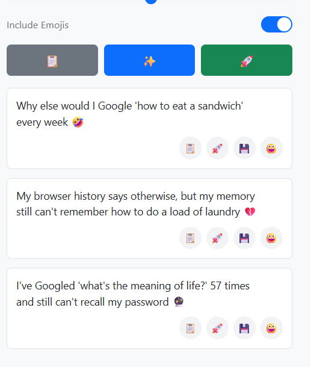

# 💬 Tweet Reply Generator Chrome Extension

A lightweight Chrome extension that uses local LLMs (like LLaMA or Gemma) to generate **short, human-like Twitter replies**. Built with a focus on usability, speed, and customization.

---

## 🚀 Features

- 🔁 One-click tweet text extraction
- ✍️ Choose from different reply styles:
  - Funny, Casual, Professional, Sarcastic, Motivational
- 🧠 Works with local models like `llama3.2:3b`, `gemma3:1b`
- 🔄 Regenerate responses easily
- 📋 Click to copy replies instantly
- ⏳ Loading spinner and clear feedback
- ✅ Clean, professional UI
- 🔧 Fully local – No cloud APIs used

---

## 🛠 Installation

### Prerequisites
- [Ollama](https://ollama.ai/) installed and running
- Node.js for the proxy se

### Extension Setup
1. Clone this repository
2. Install dependencies: `npm install`
3. Start the proxy server: `node server.js`
4. Load the extension in your browser:
   - Chrome: `chrome://extensions` → Enable "Developer mode" → "Load unpacked"

## Configuration
Configure your default model and settings in the extension's settings panel.

---

## 📸 Screenshots

## ✨ Usage

1. Open any tweet on Twitter (now X)
2. Click the extension icon
3. The tweet text is auto-filled
4. Select reply style and model
5. Click "✨ Generate Replies"
6. Click a reply to copy it instantly

## 🤔 FAQ
Q: Can I use this without Ollama?
A: No - this is designed specifically for local AI processing. Try Ollama.ai for easy setup.

Q: What's the best model for replies?
A: We recommend llama3.2:3b for balanced quality/speed or gemma3:1b for faster responses.

Q: Is this against Twitter's ToS?
A: The extension doesn't automate posting - you control when replies are sent.

