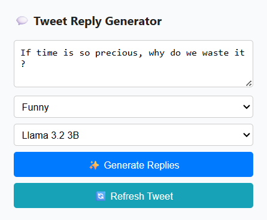

# 💬 Tweet Reply Generator Chrome Extension

A lightweight Chrome extension that uses local LLMs (like LLaMA or Gemma) to generate **short, human-like Twitter replies**. Built with a focus on usability, speed, and customization.

---

## 🚀 Features

- 🔁 One-click tweet text extraction
- ✍️ Choose from different reply styles:
  - Funny, Casual, Professional, Sarcastic, Motivational
- 🧠 Works with local models like `llama3.2:3b`, `gemma3:1b`
- 🔄 Regenerate responses easily
- 📋 Click to copy replies instantly
- ⏳ Loading spinner and clear feedback
- ✅ Clean, professional UI
- 🔧 Fully local – No cloud APIs used

---

## 🛠 Installation

1. Clone this repo or [Download ZIP](https://github.com/YOUR_USERNAME/tweet-reply-generator/archive/refs/heads/main.zip)
2. Open `chrome://extensions/` in your browser
3. Enable **Developer Mode**
4. Click **Load Unpacked**
5. Select the folder containing this repo

---

## 📸 Screenshots

